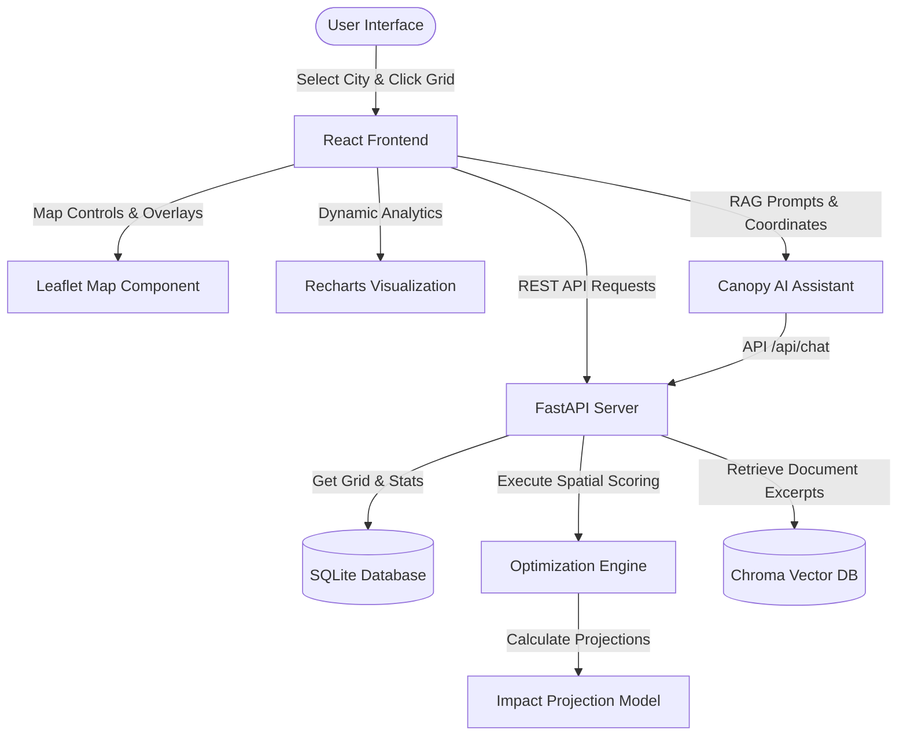

# 🌿 CanopyCast

### Hyper-Local Urban Heat & Green-Corridor Planner

> **Turning urban environmental data into actionable, climate-positive planting decisions.**

[](https://react.dev/)
[](https://vitejs.dev/)
[](https://www.python.org/)
[](https://fastapi.tiangolo.com/)
[](https://leafletjs.com/)
[](https://recharts.org/)
[](https://www.langchain.com/)
[](https://www.sqlite.org/)
[](https://tailwindcss.com/)

**Live Demo:** [Live Demo]((https://canopycast-frontend.onrender.com))

**Repository:** `https://github.com/riyanshika7/CANOPYCAST.git`

---

## 💡 The Big Idea

Cities are heating up at an alarming rate, but heat exposure is highly localized. Concrete-dense street cores act as heat cookers, while tree-shaded blocks remain significantly cooler. Municipal planners need to move from broad assumptions (*"our city has a heat problem"*) to hyper-local precision (*"this specific coordinate is where planting a tree yields the maximum combined cooling and ecological impact"*).

**CanopyCast** resolves this planning bottleneck. By mapping cities into microclimate coordinate grids, it calculates optimal planting points based on heat index, foliage deficits, demographics, and ecological connectivity, recommending native species via local forestry manuals using **Retrieval-Augmented Generation (RAG)**.

```text
Urban Environmental Data
          ↓
     Spatial Grid
          ↓
 Heat + Canopy + Exposure
          ↓
 Multi-Objective Scoring
          ↓
 Priority Planting Zones
          ↓
 Native Tree Recommendations
          ↓
 Community Action
```

---

## 🌡️ The Problem

1. **Urban Heat Islands (UHI):** Densely paved neighborhoods trap solar radiation, creating localized temperature pockets up to 8°C warmer than surrounding green spaces.
2. **Foliage Deficits:** Trees are often planted in vacant spaces rather than hot zones that need shade most.
3. **Habitat Fragmentation:** Fragmented city parks isolate urban wildlife, reducing biodiversity.
4. **Actionable Data Gaps:** Converting massive GIS raster layers into actionable, localized planting blueprints is slow and mathematically challenging.

---

## 🧬 Key Features

### 🗺️ Interactive Urban Heat Map
Clickable city coordinate grid overlays color-coded by temperature, canopy cover, or population vulnerability layers using **Leaflet.js**.

### ⚡ Multi-Objective Scoring Optimizer
Evaluates candidate blocks dynamically to find high-impact targets, enforcing spatial separation constraints so trees are not clustered in a single area.

### 📊 Microclimate Data Charts
A sidebar displaying selected location snapshots, current temperatures vs. city averages, and historical temperature deltas using **Recharts**.

### 🌳 Projected Climate Impact
Quantified estimations of planting impact: localized temperature reduction ($\Delta^{\circ}\text{C}$), annual CO₂ absorption, and stormwater runoff mitigation.

### 🤖 Grounded Canopy Assistant
A collapsible floating AI assistant using **LangChain** and **ChromaDB** to extract species, spacing, and maintenance guidelines directly from municipal manuals with verified page citations.

---

## ⚙️ Technical Architecture



---

## 📈 Multi-Objective Scoring & Corridor Logic

The optimization engine evaluates grid cells using a weighted multi-objective equation:

$$\text{Priority Score} = w_1 \cdot \text{Heat}_{\text{norm}} + w_2 \cdot \text{CanopyDeficit} + w_3 \cdot \text{PopExposure} + w_4 \cdot \text{CorridorScore}$$

### Scoring Terms:
*   **$\text{Heat}_{\text{norm}}$ ($w_1 = 0.35$):** Min-max normalized cell temperature relative to the city grid.
*   **$\text{CanopyDeficit}$ ($w_2 = 0.20$):** Linear scale of bareness: $\frac{100.0 - \text{Canopy}\%}{100.0}$.
*   **$\text{PopExposure}$ ($w_3 = 0.25$):** Demographic vulnerability weighting ($\text{Low} = 0.0$, $\text{Medium} = 0.5$, $\text{High} = 1.0$).
*   **$\text{CorridorScore}$ ($w_4 = 0.20$):** Measures the cell's potential to bridge isolated green spaces.

### 🌲 Corridor Bridging Logic:
A cell scores highest when it sits directly in the gap between two separate forest anchors:

$$\text{CorridorScore} = \text{BridgingFactor} \cdot \text{ProximityFactor} \cdot \text{GreennessPenalty}$$

*   **Bridging Factor:** $\frac{d_{\text{anchor-pair}}}{d_{\text{anchor1}} + d_{\text{anchor2}}}$ — approaches 1.0 when the coordinate sits on a direct vector between two green reserve centroids.
*   **Proximity Factor:** $\max(0, 1 - \frac{d_1 + d_2}{2 \cdot \text{diagonal}})$ — decays to 0 as the cell drifts away from the anchors (preventing isolated plantings).
*   **Greenness Penalty:** $1.0 - \frac{\text{Canopy}\%}{100.0}$ — suppresses cells that are already heavily canopy-dense.

---

## 🤖 Urban Forestry RAG System

To generate reliable recommendations, our AI agent reads official municipal manuals (e.g., the *West Bengal Trees Protection Act* guidelines).

1. **Ingestion:** Documents in `backend/documents/` are chunked and vectorized using standard embeddings.
2. **Hybrid Retrieval:** Excerpts are retrieved by combining dense vector distances (Chroma) with lexical matches (BM25) via **Reciprocal Rank Fusion (RRF)**. This prevents vector blurring on specific botanical species tokens (e.g. *Azadirachta indica*).
3. **Answering:** Prompt contexts are grounded in the selected cell’s UHI index, producing tailored recommendations and verified source citations.

---

## 🛠️ Tech Stack

| Layer | Technology | Usage |
| :--- | :--- | :--- |
| **Frontend** | React, Vite | Single-page UI workspace & fast HMR. |
| **Mapping** | Leaflet.js | Interactive grid overlays & coordinate markers. |
| **Visualization** | Recharts | Contextual temperature delta bar graphs. |
| **Backend** | FastAPI, Uvicorn | Lightweight API gateway & database routing. |
| **Database** | SQLite, ChromaDB | Seeding grid metrics & vector store indexing. |
| **AI / RAG** | LangChain, OpenAI | Hybrid retrieval pipelines & prose responses. |
| **Styling** | Tailwind CSS | Clean, responsive light-theme styling tokens. |

---

## 🧭 Setup & Installation

### Prerequisites
*   Node.js (v18+) & npm
*   Python (3.11 or 3.12 recommended for ChromaDB compatibility)

### 🚀 Running the Project

#### 1. Backend Server Setup
Navigate to the `/backend` folder, set up your virtual environment, and install packages:
```bash
cd backend
python -m venv .venv
# Activate on Windows:
.\.venv\Scripts\activate
# Activate on Mac/Linux:
source .venv/bin/activate

pip install -r requirements.txt
```

Set up your API keys (copy from example):
```bash
cp .env.example .env
# Open .env and add: OPENAI_API_KEY=your_key_here
```

Ingest documents to compile the vector database index:
```bash
python -m app.ingest
```

Start the Uvicorn server:
```bash
python -m uvicorn app.main:app --reload
```
*Backend endpoints live at `http://127.0.0.1:8000`. Interactive docs at `http://127.0.0.1:8000/docs`.*

#### 2. Frontend Server Setup
Open a second terminal, navigate to `/frontend`, install packages, and start the development server:
```bash
cd frontend
npm install
npm run dev
```
*Frontend workspace lives at `http://localhost:5173` (or `http://localhost:5174`).*

---

## 🧭 How to Use CanopyCast

1. **Pick a City:** Select Kolkata, Delhi, or Goa from the header selector. The Leaflet map will automatically pan and render that city's spatial grid.
2. **Select a Block:** Click any colored square tile to view target coordinates, current temperature, canopy coverage, and population density.
3. **Compare Deltas:** The analytics dashboard displays how much warmer/cooler the selected block is compared to the city average.
4. **Optimize:** Click **Optimize Green Canopy**. The algorithm evaluates the grid and draws green markers pointing to high-impact coordinates, updating the dashboard with aggregated CO₂ and stormwater diversion projections.
5. **Consult Canopy AI:** Click **Canopy Assistant** in the bottom-right corner and ask species-specific planting or regulatory questions grounded in local guidelines.

---

## 👥 The Team

*   **Riyanshika:** *Lead Developer* — Frontend UI, chatbot Integration, and Dashboard Layouts.
*   **Nitesh Barnwal:** *Frontend Developer* — Leaflet Map Grid overlay, state bindings, and Recharts displays.
*   **Chirag:** *AI & Backend Engineer* — FastAPI endpoints, SQLite grid seeding, multi-objective scoring algorithms, and LangChain RAG pipeline.

---

## 🌎 Built to Protect the Planet

CanopyCast addresses **climate adaptation** directly by targeting localized microclimates. Instead of passive monitoring, it turns data into targeted greening plans—helping cities combat the Urban Heat Island effect, restore biodiversity corridors, and coordinate planting drives using verified regional manuals.

> **CanopyCast turns environmental intelligence into planting intelligence — helping cities move from simply measuring heat to planning for cooler, greener, more connected neighborhoods.**
