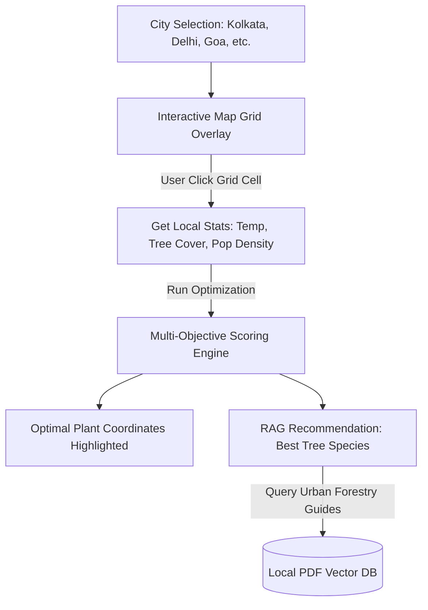

# CanopyCast: Hyper-Local Urban Heat & Green-Corridor Planner

This blueprint outlines the final concept, architecture, and division of labor for **CanopyCast**. This project addresses a massive climate crisis—Urban Heat Islands (UHI)—and provides a highly visual, optimization-driven tool that bridges raw spatial data and community action.

---

## 🛰️ Project Concept

**CanopyCast** is an interactive, map-based planning tool. Users select an urban city, view heat gradients, and click on specific neighborhoods. The tool uses a multi-objective scoring algorithm to identify the optimal spots to plant trees, maximizing both **cooling impact** (reducing UHI) and **wildlife corridor connectivity** (linking existing green spaces).

---

## ⚙️ Technical Architecture & Core Algorithms

### 1. The Synthetic City Grid (Chirag's Domain)
Instead of processing complex geo-TIFF rasters live, the backend generates a **synthetic 2D coordinate grid** for target cities (e.g., a $20 \times 20$ grid of cells covering a city area):
*   For each grid cell $C_{x,y}$, the database pre-populates:
    *   `base_temperature` ($^{\circ}\text{C}$): Higher in concrete-dense areas.
    *   `canopy_cover` ($0\%$ to $100\%$): Percentage of tree cover.
    *   `population_density`: Low, Medium, High.
    *   `park_proximity`: Distance to nearest major nature reserve/park.

### 2. The Multi-Objective Scoring Algorithm (Chirag's Domain)
When the user clicks "Run Planner", the backend runs a scoring algorithm over all cells in the selected bounding box to identify the best candidates for planting:
$$\text{Priority Score} = w_1 \cdot (T_{\text{local}} - T_{\text{target}}) + w_2 \cdot (100 - \text{Canopy}\%) + w_3 \cdot \text{PopDensity} + w_4 \cdot \text{CorridorScore}$$
*   **CorridorScore:** Measures if planting a tree in this cell bridges a gap between two existing green spaces (closer to existing parks, but not already inside one).
*   **Result:** The API returns the top 3–5 coordinates with the highest priority scores.

### 3. Urban Forestry RAG System (Chirag's Domain)
*   **Vector Database:** Contains PDF documents of urban forestry guidelines, detailing which tree species are native, drought-resistant, and high-shade for specific regions (e.g., Neem and Gulmohar for Kolkata; Banyan and Peepal for Delhi).
*   **RAG Query:** Uses LangChain to ask: *"Based on coordinate inputs, what native trees should be planted in [City] to maximize shade and survive local climate constraints?"* 
*   **Output:** Recommends 2-3 specific tree species, their planting spacing, and estimated carbon sequestration numbers.

---

## 🎨 Frontend & UI/UX (Riyanshika + Nitesh's Domain)

A stunning interactive map is the core of this project. **Nitesh** and **Riyanshika** will collaborate on the React frontend:

### 🗺️ The Map Interface (Nitesh)
*   Integrate **Leaflet.js** or **Mapbox** into the React structure.
*   Draw a clickable grid layer over the selected city.
*   Color-code the grid cells using a temperature gradient heatmap (**Red** = Hot Concrete, **Blue** = Cool Green Space).
*   When a user clicks "Optimize", draw highlighted **Green Circle Markers** representing the algorithm's recommended planting zones.

### 📊 The Dashboard & Chatbot (Riyanshika)
*   **Analytics Panel:** When a grid cell is clicked, render interactive charts (using **Recharts**) showing its canopy cover, current temperature vs. city average, and population exposure.
*   **GenAI Planner:** An interactive side panel hosting the "Canopy Assistant" chatbot. Citizens can ask: *"How can I organize a local planting drive?"* or *"What care does a young Neem tree need?"*
*   **Styling & Polish:** Own the Tailwind CSS styling, ensure clean grid transitions, and design a highly usable side-bar layout.

---

## 📋 Step-by-Step 3-Day Sprint Roadmap

| Phase | Developer Focus | Key Milestone |
| :--- | :--- | :--- |
| **Day 1: Scaffolding** | **Chirag:** Set up FastAPI and generate the synthetic city grid database. **Nitesh:** Render Leaflet map with interactive grid cells. **Riyanshika:** Structure the main dashboard side-panel mockup. | City map loaded with temperature grid overlays. |
| **Day 2: Features** | **Chirag:** Implement UHI optimization algorithm and RAG tree recommendations. **Nitesh:** Bind map selections to React state and render planting markers. **Riyanshika:** Embed comparative Recharts graphs and Chatbot UI panels. | Optimization engine functional, charts rendering, and chatbot responsive. |
| **Day 3: Deploy & Pitch** | **All:** Connect API integrations, resolve CSS bugs, deploy live (Vercel/Render). Record the 3-minute walk-through demo video. | Fully deployed web app and pitch submission. |

---

## ⚖️ Judging Criteria Optimization (Amendments for #1 Spot)

To maximize your score across all five hackathon criteria, the following features have been integrated into the project scope:

### 1. Environmental Impact (30% weight) ➔ Quantified Projections
*   **The Hack:** Judges evaluate "meaningful impact." Showing a map of suggested trees is good, but showing the *quantified effect* of those trees is winner-grade.
*   **Amendment:** The backend `POST /api/optimize` will return calculated projections for the recommended planting zone:
    *   `estimated_cooling_effect`: e.g., $-1.6^\circ\text{C}$ local canopy temperature reduction.
    *   `co2_sequestration_kg`: Projected annual carbon absorption.
    *   `stormwater_gallons_diverted`: Annual reduction in urban surface runoff.
*   *Action:* Riyanshika and Nitesh will display these metrics in the sidebar Dashboard with green badges labeled *"Projected Environmental Impact."*

### 2. Design and Usability (20% weight) ➔ Mobile Responsive Layout
*   **The Hack:** Many hackathon judges view submissions on mobile devices. If a Leaflet map layout breaks or is cut off on small screens, your usability score drops.
*   **Amendment:** The CSS template must use Tailwind responsive prefixes (`sm:`, `md:`, `lg:`). On mobile screens, the dashboard sidebar will slide underneath the map view, or collapse into a bottom sheet, keeping the app 100% usable.

### 3. Execution (15% weight) ➔ Loading Spinners & Error Boundaries
*   **The Hack:** A working, polished prototype must handle network latency. If the optimization takes 2 seconds to load and the screen is frozen, it feels unpolished.
*   **Amendment:** Introduce loading spinners (`isLoading` states in React) when calling `/api/optimize` or sending messages to `/api/chat`.
